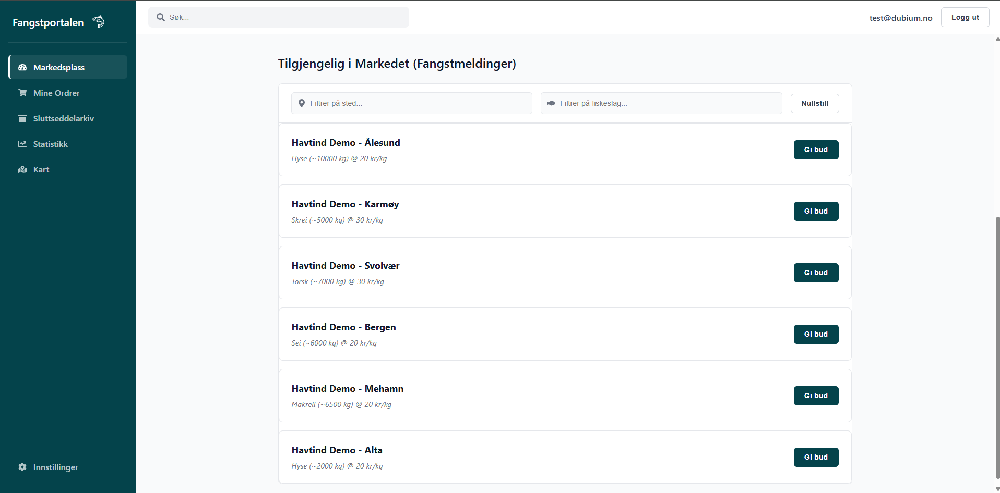
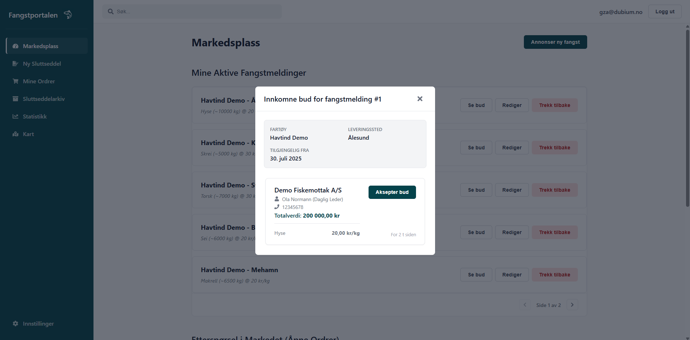
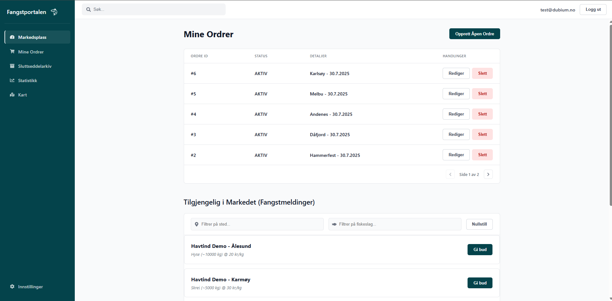
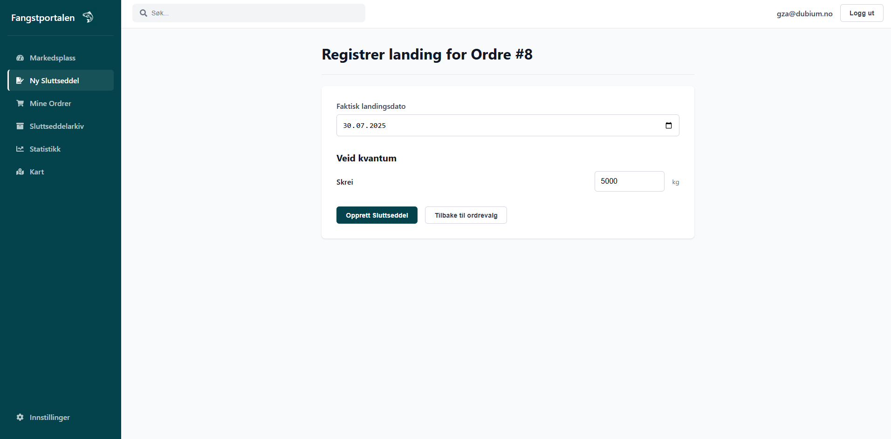
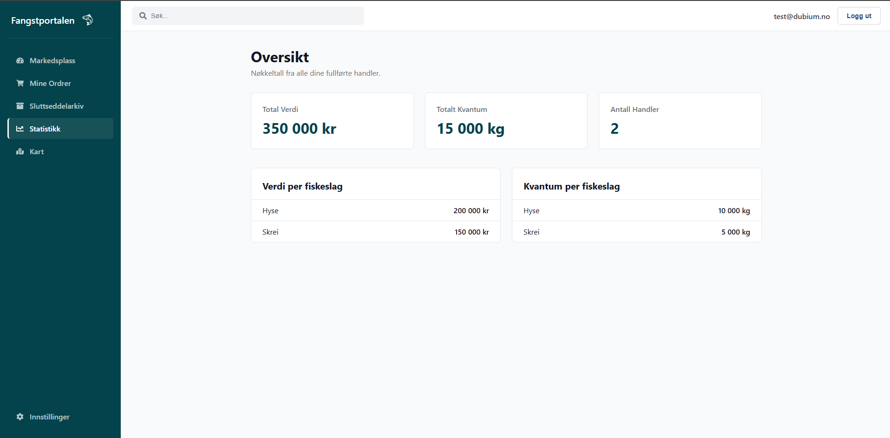
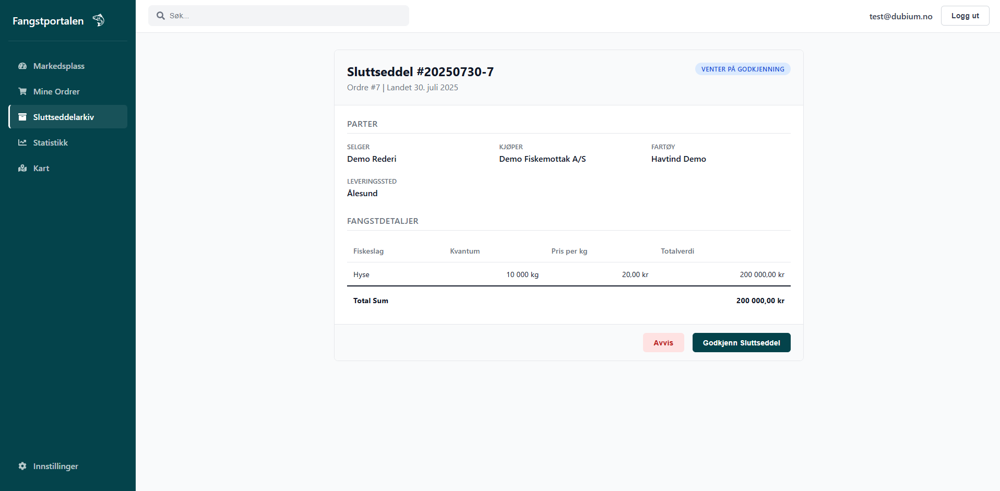

# FangstPortalen: Digital Markedsplass for Sjømat


Velkommen til **FangstPortalen**, en fullstack webapplikasjon designet for å modernisere og sikre førstehåndsomsetningen av sjømat. Prosjektet fungerer som en digital markedsplass hvor rederier og fiskebruk kan handle direkte, basert på en transparent, sikker og effektiv arbeidsflyt.

Dette er et **monorepo** som inneholder hele applikasjonen.

**Live Demo:** [https://www.fangstportalen.no](https://www.fangstportalen.no)

---

## Innholdsfortegnelse

- [Om Prosjektet](#om-prosjektet)
  - [Prosjektstatus og Formål](#prosjektstatus-og-formål)
  - [Hovedfunksjoner](#hovedfunksjoner)
  - [Sikkerhetsarkitektur](#sikkerhetsarkitektur)
  - [Teknologistack](#teknologistack)
- [Visuell Oversikt](#visuell-oversikt)
- [Prosjektstruktur](#prosjektstruktur)
  - [Frontend (`frontend`)](#frontend-frontend)
  - [Backend (`service-handel`)](#backend-service-handel)
- [Komme i Gang (Lokalt)](#komme-i-gang-lokalt)
  - [Forutsetninger](#forutsetninger)
  - [Installasjon og Kjøring](#installasjon-og-kjøring)
- [Lisens](#lisens)

---

## Om Prosjektet

FangstPortalen ble utviklet for å adressere ineffektivitet og mangel på transparens i tradisjonell omsetning av fisk. Ved å digitalisere hele prosessen – fra fangstmelding til budrunde og endelig oppgjør via en digital sluttseddel – skaper plattformen et verifiserbart og uforanderlig system bygget på tillit.

### Prosjektstatus og Formål

**Dette er et studentutviklet porteføljeprosjekt.** Hensikten er å demonstrere ferdigheter innen fullstack-utvikling, sikker systemarkitektur for B2B SaaS, og moderne DevOps-prinsipper.

*   **Prototype:** Applikasjonen er en fullt fungerende prototype, men er **ikke** ment for reell kommersiell bruk.
*   **Demonstrasjon:** Prosjektet fungerer som en "proof-of-concept" for en tilstandsdrevet, sikker handelsflyt. All data i systemet er fiktiv og kun for demonstrasjonsformål.

### Hovedfunksjoner

-   **Dynamisk Markedsplass:** Både rederier (selgere) og fiskebruk (kjøpere) får en sanntidsoversikt over tilbud og etterspørsel i markedet.
-   **Sikker Budrunde:** Innkjøpere kan gi bud på spesifikke fangster, og skippere får en komplett oversikt før de aksepterer. Et akseptert bud genererer automatisk en bindende ordre.
-   **Digital Sluttseddel:** Eliminerer papirarbeid ved at skippere registrerer landet kvantum direkte fra en låst ordre, noe som umiddelbart genererer en digital sluttseddel.
-   **Bilateral Verifisering:** En sluttseddel er ikke gyldig før den er digitalt godkjent av *begge* parter (kjøper og selger), noe som skaper en uforanderlig transaksjonshistorikk.
-   **Statistikk og Innsikt:** Et dashboard gir brukerne innsikt i egen handelshistorikk, med oversikt over totalverdi, kvantum og lønnsomhet per fiskeslag og handelspartner.
-   **Rollebasert Tilgangskontroll (RBAC):** Strenge roller (`SKIPPER`, `REDERI_ADMIN`, `FISKEBRUK_INNKJOPER`) definerer nøyaktig hva en bruker kan se og gjøre.

### Sikkerhetsarkitektur

Sikkerhet er designet inn fra grunnen av:
-   **Autentisering med Auth0:** All brukerhåndtering er delegert til Auth0 for enterprise-grade sikkerhet.
-   **JWT Claims:** Kritiske brukerrettigheter (organisasjons-ID, roller, tildelt fartøy) blir injisert som sikre claims i brukerens JWT-token via en Auth0 Action.
-   **Streng Multi-Tenancy:** Backend håndhever datasegregering kompromissløst. Hver eneste databaseoperasjon filtreres på `org_id` fra tokenet, noe som gjør det teknisk umulig for en organisasjon å se en annens data.

### Teknologistack

-   **Frontend:** React 19, TypeScript, Vite, React Router, Zod (validering), CSS Modules.
-   **Backend:** Java 21, Spring Boot 3, Spring Data JPA, Spring Security (OAuth2 Resource Server).
-   **Database:** PostgreSQL 16.
-   **Autentisering:** Auth0.
-   **Containerisering & DevOps:** Docker, Docker Compose.
-   **Hosting:** Heroku (for applikasjonene) og Supabase (for databasen).

---

## Visuell Oversikt

Her er noen glimt fra plattformens ulike funksjoner.

| Markedsplass for Innkjøper | Gi bud på en fangst |
| :----------------------------------------------------------: | :----------------------------------------------------------: |
|  |  |
| **Mine Ordrer** | **Opprett Digital Sluttseddel** |
|  |  |
| **Statistikk-dashboard** | **Godkjenning av Sluttseddel** |
|  |  |

---

## Prosjektstruktur

### Frontend (`frontend`)
```
frontend
├── src/
│   ├── components/      # Gjenbrukbare React-komponenter (Sidebar, Modals, etc.)
│   ├── hooks/           # Custom React hooks (useClaims, etc.)
│   ├── pages/           # Komponenter for hver side/rute
│   ├── schemas/         # Zod-valideringsskjemaer
│   ├── services/        # API-kall (apiService.ts)
│   ├── types/           # TypeScript-definisjoner
│   └── main.tsx         # Appens inngangspunkt med Auth0Provider
├── Dockerfile
├── nginx.conf.template  # Nginx-konfigurasjon for Heroku
└── package.json
```

### Backend (`service-handel`)
```
service-handel
├── src/main/java/.../servicehandel/
│   ├── auth0/           # Service for å snakke med Auth0 Management API
│   ├── bruker/          # Endepunkter for brukerprofil
│   ├── bud/             # Logikk og endepunkter for budgivning
│   ├── config/          # Spring Security, WebConfig, GlobalExceptionHandler
│   ├── fangstmelding/   # Logikk og endepunkter for fangstmeldinger
│   ├── fartoy/          # Logikk og endepunkter for fartøy
│   ├── internal/        # Interne API-er brukt av Auth0 Actions
│   ├── ordre/           # Logikk og endepunkter for ordrer
│   ├── organisasjon/    # Onboarding og organisasjonslogikk
│   ├── sluttseddel/     # Logikk og endepunkter for sluttsedler
│   ├── statistikk/      # Logikk og endepunkter for statistikk
│   └── team/            # Logikk og endepunkter for team-administrasjon
├── Dockerfile
├── pom.xml
└── src/main/resources/
    └── application.properties
```

---

## Komme i Gang (Lokalt)

Prosjektet er fullt containerisert og kjøres enklest med Docker Compose.

### Forutsetninger

-   Docker Desktop installert og kjørende.
-   Git.
-   En Auth0-konto for å hente ut nødvendige nøkler.

### Installasjon og Kjøring

1.  **Klone repoet:**
    ```bash
    git clone https://github.com/ditt-brukernavn/FangstPortalen.git
    cd FangstPortalen
    ```

2.  **Opprett `.env`-fil:**
    Opprett en fil som heter `.env` i roten av prosjektet. Denne filen må inneholde alle miljøvariablene som er listet i `service-handel/src/main/resources/application.properties` og de som trengs for frontend (`VITE_...`). Fyll ut med dine egne nøkler fra Auth0.

3.  **Bygg og start containerne:**
    ```bash
    docker-compose up --build
    ```
    Dette vil bygge både frontend- og backend-imagene og starte alle tjenestene (Postgres, Backend, Frontend).

4.  **Åpne i nettleseren:**
    -   Frontend vil være tilgjengelig på `http://localhost:5173`.
    -   Backend API vil være tilgjengelig på `http://localhost:8080`.

---

